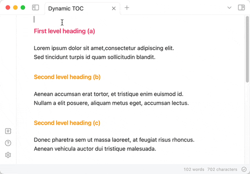

# Obsidian Automatic Table Of Contents

[](https://obsidian.md/plugins?search=automatic%20table%20of%20contents)
[](https://github.com/johansatge/obsidian-automatic-table-of-contents/releases)
[](https://github.com/johansatge/obsidian-automatic-table-of-contents/actions)

> An Obsidian plugin to create a table of contents in a note, that updates itself when the note changes

---



- [Installation](#installation)
  - [From Obsidian (easiest)](#from-obsidian-easiest)
  - [From git](#from-git)
  - [From source](#from-source)
- [Usage and options](#usage-and-options)
- [Limitations and known bugs](#limitations-and-known-bugs)
- [Publish a new version](#publish-a-new-version)
- [Changelog](#changelog)
- [License](#license)
- [Contributing](#contributing)

## Installation

### From Obsidian (easiest)

Install the plugin from the [Community plugins](https://obsidian.md/plugins?search=automatic%20table%20of%20contents) section in the app settings.

### From git

Clone the plugin in your `.obsidian/plugins` directory:

```shell
cd /path/to/your/vault/.obsidian/plugins
git clone git@github.com:johansatge/obsidian-automatic-table-of-contents.git
```

### From source

Download the [latest release](https://github.com/johansatge/obsidian-automatic-table-of-contents/releases) and unzip it in the `.obsidian/plugins/automatic-table-of-contents` directory.

## Usage and options

Insert a codeblock with the `table-of-contents` (or its short version `toc`) syntax.

````
```table-of-contents
option1: value1
option2: value2
```
````

Alternatively, two commands are available in the command palette:

- Insert table of contents
- Insert table of contents (documented)

The following options are available:

| Option | Default value | Description |
| --- | --- | --- |
| `title` | _None_ | Title to display before the table of contents (supports Markdown) |
| `style` | `nestedList` | Table of contents style (can be `nestedList`, `nestedOrderedList` or `inlineFirstLevel`) |
| `minLevel` | `0` | Include headings from the specified level  (`0` for no limit) |
| `maxLevel` | `0` | Include headings up to the specified level (`0` for no limit) |
| `includeLinks` | `true` | Make headings clickable |
| `debugInConsole` | `false` | Print debug info in Obsidian console |

## Limitations and known bugs

- The table of contents may not be generated correctly if the document doesn't implement a correct titles hierarchy (level 1 title then level 3 without a level 2 in between, for instance)
- HTML & markdown that may be in the document headings are stripped when `includeLinks: true` (see [#24](https://github.com/johansatge/obsidian-automatic-table-of-contents/issues/24) & [#27](https://github.com/johansatge/obsidian-automatic-table-of-contents/issues/27))
- LaTeX equations are not rendered correctly when `includeLinks: true` (see [#13](https://github.com/johansatge/obsidian-automatic-table-of-contents/issues/13))

## Publish a new version

- Push a commit with the new version number as message with:
  - The relevant changelog in `README.md`
  - The new version number in `manifest.json`
- Tag the commit with the version number
- Publish a [new GitHub release](https://github.com/johansatge/obsidian-automatic-table-of-contents/releases/new) with:
  - The version number as title
  - The changelog from `README.md` as description
  - `main.js` and `manifest.json` as attachments
  - _Set as the latest release_ checked

## Changelog

This project uses [semver](http://semver.org/).

| Version | Date | Notes |
| --- | --- | --- |
| `1.4.0` | 2024-05-19 | Add `nestedOrderedList` style ([@bjtho08](https://github.com/bjtho08)) (fix #41) |
| `1.3.3` | 2024-05-16 | Compute the right min level when `style:inlineFirstLevel` (fix #39) |
| `1.3.2` | 2024-02-18 | Harden headings stripping |
| `1.3.1` | 2024-02-18 | Strip headings for readability (fix #24, #27) |
| `1.3.0` | 2024-02-17 | Introduce `title` option (fix #5, #32) |
| `1.2.0` | 2024-01-19 | Introduce `toc` shorthand trigger (fix #19) |
| `1.1.0` | 2024-01-03 | Introduce `minLevel` option ([@ras0q](https://github.com/ras0q)) (fix #11) |
| `1.0.6` | 2023-11-02 | Escape special characters (fix #3) |
| `1.0.5` | 2023-11-01 | Fix plugin activation on mobile (fix #17) |
| `1.0.4` | 2023-10-31 | Support pages with no first level headings (fix #6) |
| `1.0.3` | 2023-09-30 | Fix readme |
| `1.0.2` | 2023-09-25 | Fix output sometimes displaying `undefined` headings |
| `1.0.1` | 2023-09-09 | Fix reference to global `App` instance |
| `1.0.0` | 2023-08-27 | Initial version |

## License

This project is released under the [MIT License](LICENSE).

## Contributing

Bug reports and feature requests are welcome! More details in the [contribution guidelines](CONTRIBUTING.md).
